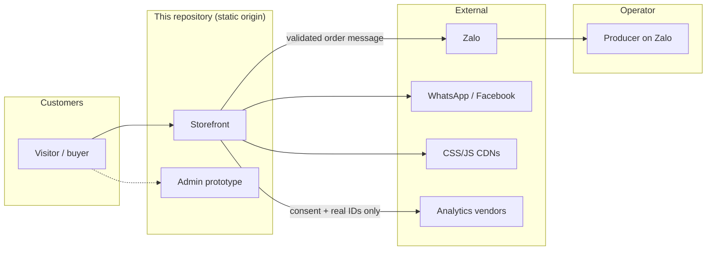
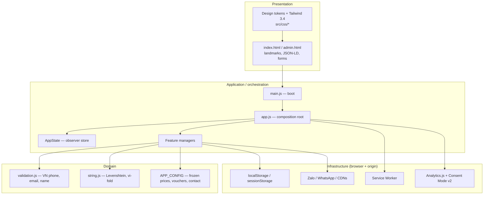
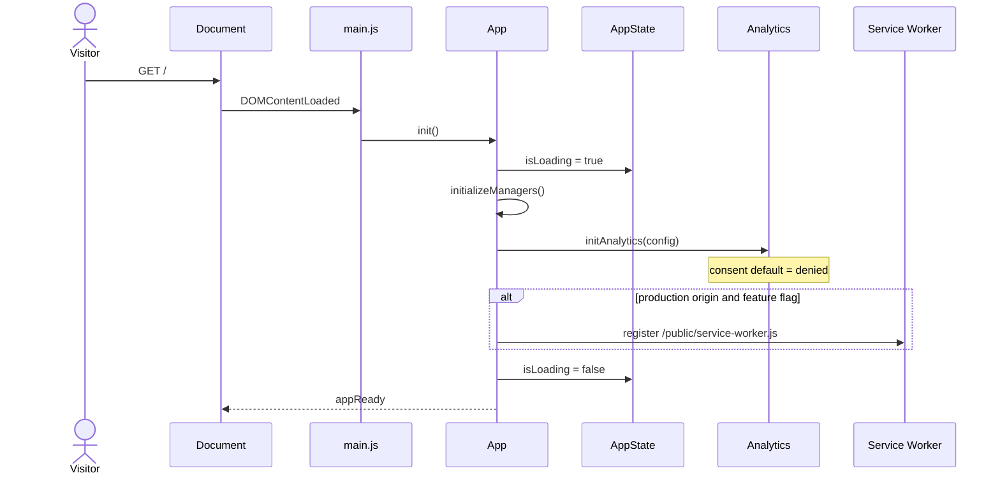
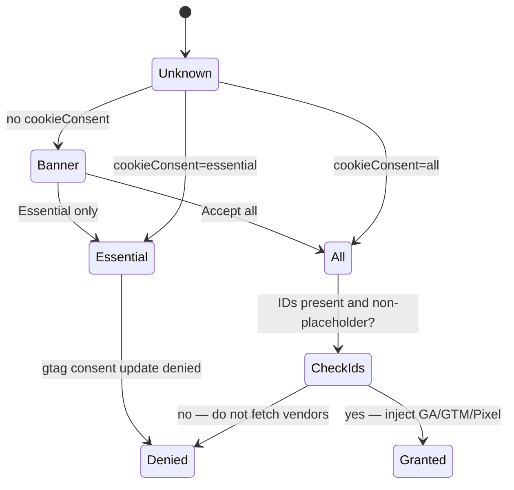
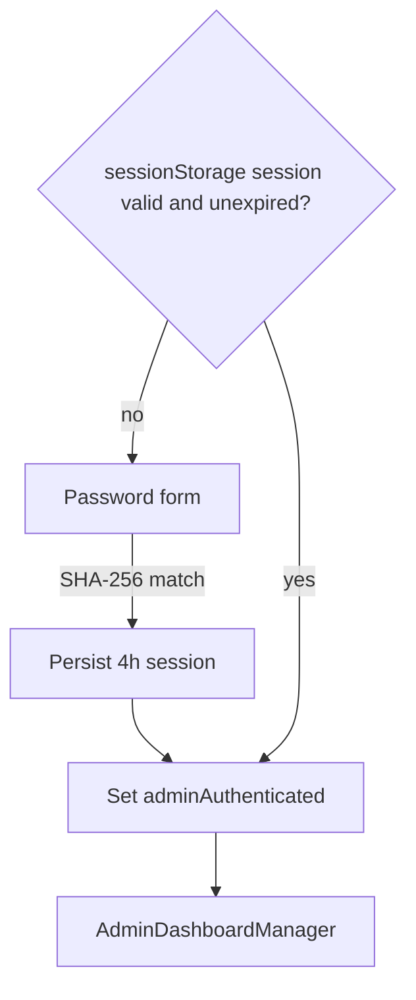

# DeltaDev Link

A bilingual, progressively enhanced storefront for an artisan sausage producer in Cai Be, Tien Giang, Vietnam.

The application is a static front end. Product discovery, cart state, and account UI run in the browser. Order completion is handed off to Zalo. This repository does not include a payment processor, inventory service, or server-side identity provider.

| Field | Value |
| --- | --- |
| Document status | Current |
| Application version | 3.2.1 |
| Document type | Technical architecture and operating model |
| Classification | Public |
| License | MIT |

[](LICENSE)
[](package.json)
[](package.json)

---

## 1. Purpose

DeltaDev Link is a client-side commerce surface for a small food producer whose sales channel is messaging rather than card-not-present checkout. The system therefore optimizes for (i) bilingual product communication, (ii) validated lead capture, and (iii) a privacy-preserving analytics default — not for PCI-DSS payment flows.

This document describes the **main architecture**, the **MVP boundary**, the **technology stack**, **business rules**, and **operating flows** as implemented in the repository. Claims that cannot be verified in code are marked as operator policy.

---

## 2. Context



The producer confirms price, stock, delivery slot, and payment **outside** this application. The website is a capture and presentation layer.

---

## 3. MVP definition

The shipped system is an **MVP 1.0** in the GovTech sense: the smallest set of capabilities that lets a real customer discover a product and place a verified enquiry, with privacy defaults that would pass a basic PDPA / GDPR-style review.

### 3.1 Must have (delivered)

| ID | Capability | Evidence in repo |
| --- | --- | --- |
| M1 | Bilingual storefront (`en` / `vi`) | `LanguageManager`, `?lang=` |
| M2 | Catalog and product narrative | `index.html` sections `#products`, `#about`, `#quality` |
| M3 | Order form with Vietnamese mobile validation | `FormHandler`, `utils/validation.js` |
| M4 | Handoff to Zalo with a structured message | `FormHandler.openZalo`, cart checkout |
| M5 | Cart, voucher check, min-order hint | `ShoppingCartManager`, `APP_CONFIG.cart` |
| M6 | Consent default-denied; no dummy pixels | `Analytics.js`, cookie dialog |
| M7 | Installable PWA with resilient precache | `public/manifest.json`, `service-worker.js` |
| M8 | WCAG-oriented landmarks and FAQ accordion | skip link, `aria-expanded`, `prefers-reduced-motion` |

### 3.2 Should have (client-side only; not authoritative)

Wishlist, comparison (max 3 SKUs), reviews UI, loyalty UI, newsletter capture, live-chat launcher, demo admin dashboard. These persist in `localStorage` and must not be treated as a source of truth.

### 3.3 Will not have in MVP 1.0

- Card, e-wallet, or QR payment capture
- Server-side accounts, inventory, or order ledger
- Certified WCAG audit or PCI-DSS scope
- Compiled Tailwind / vendored third-party JS
- Production identity for `/admin.html`

### 3.4 Later increments (not in this tree)

| Phase | Intent |
| --- | --- |
| 1.1 | Compile Tailwind, pin CDN assets with SRI, move CSP to HTTP headers |
| 2.0 | API for orders and stock; operator console with a real IdP |
| 2.1 | Payment rails (e.g. PayNow-equivalent in VN: bank transfer confirmed by operator, then gateway) |
| 3.0 | OMS, delivery SLA, and finance reconciliation |

---

## 4. Main architecture

The architecture is a **layered browser application** with a single composition root. There is no application server. Persistence is the Web Storage API. Integration is outbound HTTPS to messaging and, optionally, measurement vendors.

### 4.1 Logical layers



| Layer | Responsibility | Must not |
| --- | --- | --- |
| Presentation | Markup, landmarks, visual system | Embed business numbers except via config |
| Application | Boot order, manager lifecycle, SW, consent | Call CDNs for business data |
| Domain | Prices, vouchers, validation, search similarity | Touch the DOM |
| Infrastructure | Storage, cache, outbound links | Invent order IDs that look official |

### 4.2 Module map

```
index.html                 document shell
admin.html                 prototype operations UI
src/js/main.js             boot; fail-closed error surface
src/js/app.js              composition root
src/js/config/             frozen app + environment config
src/js/state/AppState.js   observer-based in-memory state
src/js/managers/           UI feature controllers
src/js/features/           search, wishlist, comparison, reviews
src/js/services/           analytics loader, platform helpers
src/js/utils/              validation, hashing, logging, formatters
src/css/                   tokens, reset, components
public/                    manifest, service worker, robots, sitemap
tests/                     Node.js test runner
```

### 4.3 Runtime sequence (boot)



Design constraints:

- No bundler. ES modules load natively. Node 20+ is required only for tests and lint.
- CDN-assisted CSS/JS is acceptable for a low-traffic brochure site and incorrect for high QPS. Compile and vendor before scale.
- Fail visible: AOS must not hide content before init; images fall back to SVG placeholders.
- Config is frozen (`Object.freeze`). Managers read it; they do not mutate it.

---

## 5. Technology stack

Versions below are those referenced in `index.html`, `package.json`, and `admin.html`.

### 5.1 Runtime (browser)

| Concern | Choice | Version / pin | Role |
| --- | --- | --- | --- |
| Document | HTML5, semantic landmarks | — | Shell, SEO, a11y |
| Styling | Custom properties + Tailwind Play CDN | 3.4.1 | Utility CSS |
| Type | Google Fonts: Poppins, Playfair Display | — | UI + display |
| Language | ECMAScript 2022 modules | `type="module"` | Application code |
| Light reactivity | Alpine.js | 3.x (CDN) | Optional declarative UI |
| Motion | AOS | 3.0.0-beta.6 | Scroll reveal |
| Motion | GSAP + ScrollTrigger | 3.12.5 | Hero / scroll timelines |
| Carousel | Swiper | 11 | Product slider |
| Charts (admin) | Chart.js | 4.4.1 | Prototype dashboards |
| PWA | Web App Manifest + Service Worker | cache `deltadev-link-v3.2.1` | Install + offline shell |
| Storage | `localStorage`, `sessionStorage` | — | Cart, locale, demo session |
| Crypto (demo) | Web Crypto `SHA-256` | — | Demo password digest only |

### 5.2 Tooling (Node, not shipped to visitors)

| Concern | Choice | Version |
| --- | --- | --- |
| Runtime for tests | Node.js | >= 20 |
| Unit tests | `node:test` / `node:assert/strict` | built-in |
| Lint | ESLint | 8.57 |
| Format | Prettier | 3.2 |
| Local origin | Python `http.server` | 3.x |
| Host adapters | `netlify.toml`, `vercel.json` | security headers |

### 5.3 External systems

| System | Integration style | Notes |
| --- | --- | --- |
| Zalo | `https://zalo.me/{number}` + clipboard payload | Order of record lives here |
| WhatsApp | `wa.me` deep link | Support, not checkout |
| Facebook Page | outbound link / chat launcher | Optional |
| Google Analytics / GTM / Meta Pixel | injected only after consent and real IDs | Empty IDs = no request |

Target browsers: `> 1%`, last 2 versions, not dead, not IE 11 (`package.json` `browserslist`).

---

## 6. Business rules

Rules are numbered so they can be tested and cited in reviews. **System-enforced** rules are implemented in code. **Operator policy** is communicated on the site (FAQ / copy) and is not technically binding.

### 6.1 Catalogue and pricing

| ID | Rule | Enforcement |
| --- | --- | --- |
| BR-CAT-01 | Currency is VND. Display uses `vi-VN` grouping. | `formatVnd` |
| BR-CAT-02 | SKU prices are defined in `APP_CONFIG.products` (classic 190 000 / kg, gift 205 000 / box, lean 220 000 / kg). | Frozen config |
| BR-CAT-03 | Tax rate in config is 0. Shipping fee in config is 0. Operator may still charge delivery outside the app. | `cart.taxRate`, `cart.shippingFee` |
| BR-CAT-04 | Comparison list holds at most 3 SKUs. | `ComparisonManager.maxCompare` |

### 6.2 Cart and promotions

| ID | Rule | Enforcement |
| --- | --- | --- |
| BR-ORD-01 | Quantity per line is in `[1, 20]`. | `cart.maxQuantityPerItem` |
| BR-ORD-02 | Configured minimum order amount is 100 000 VND. | `cart.minOrderAmount` |
| BR-ORD-03 | `SUNDAY10`: 10% off, min 200 000, `active`. | `vouchers[]` |
| BR-ORD-04 | `FIRST50`: 50 000 off, min 300 000, `active`. | `vouchers[]` |
| BR-ORD-05 | `MEMBER20`: 20% off, min 500 000, `active`. | `vouchers[]` |
| BR-ORD-06 | Unknown or inactive codes are rejected. Subtotal below `minOrder` is rejected. | `applyVoucher` |
| BR-ORD-07 | Percentage discount is `subtotal * discount / 100`. Fixed discount is subtracted as-is. Total is `subtotal - discount`. | `checkout` |
| BR-ORD-08 | Empty cart cannot check out. | `checkout` |
| BR-ORD-09 | A successful form or cart checkout **does not** create a paid order. It opens Zalo. Confirmation is an operator act. | `openZalo` |

### 6.3 Customer capture

| ID | Rule | Enforcement |
| --- | --- | --- |
| BR-PII-01 | Name required, length 2–80. | `isValidName` |
| BR-PII-02 | Address required, length 8–240. | `isValidAddress` |
| BR-PII-03 | Phone must match `^(0|\+84)(3|5|7|8|9)\d{8}$` after stripping spaces, dots, dashes, parentheses. Landline `02…` is invalid. | `isValidVnPhone` |
| BR-PII-04 | Product selection is required on the order form. | `validateForm` |
| BR-PII-05 | Demo account passwords require at least 8 characters and both letters and digits. Stored as SHA-256 hex, never reused as a real credential store. | `validatePassword`, `sha256Hex` |

### 6.4 Locale, privacy, session

| ID | Rule | Enforcement |
| --- | --- | --- |
| BR-I18N-01 | Supported locales are `en` and `vi`. Default is `en`. | `APP_CONFIG.language` |
| BR-I18N-02 | Locale is taken from `?lang=`, then persisted. Switching updates `document.documentElement.lang` and the query string. | `LanguageManager` |
| BR-PRV-01 | Consent Mode defaults all storage flags to `denied`. | inline `gtag('consent','default')` |
| BR-PRV-02 | Measurement scripts load only if `cookieConsent === 'all'` **and** IDs are configured and non-placeholder. | `Analytics.js`, `isConfiguredId` |
| BR-ADM-01 | Admin prototype session TTL is 4 hours in `sessionStorage`. | `admin-auth.js` |

### 6.5 Operator policy (stated on the site; not coded as a workflow engine)

| ID | Rule | Source |
| --- | --- | --- |
| BR-OPS-01 | Delivery coverage: HCMC and Tien Giang, Binh Duong, Dong Nai, Long An, Ba Ria–Vung Tau, Can Tho. | FAQ copy |
| BR-OPS-02 | Buyer may request cancel or change within 2 hours of the Zalo message. | FAQ copy |
| BR-OPS-03 | Stated storage guidance: refrigerate up to 2 months, freeze up to 6 months. | FAQ copy |
| BR-OPS-04 | Business hours 08:00–17:00 daily. | `contact.businessHours`, JSON-LD |

---

## 7. Operating flows

### 7.1 Customer order (happy path)

```mermaid
sequenceDiagram
  actor B as Buyer
  participant UI as Storefront
  participant V as validation.js
  participant S as AppState
  participant Z as Zalo
  actor O as Operator

  B->>UI: Select SKU, qty, name, phone, address
  UI->>V: validate name / VN mobile / address / SKU
  alt invalid
    V-->>UI: field error; scroll to first failure
    UI-->>B: Correct input
  else valid
    UI->>S: formData, orderTotal
    UI->>UI: clipboard.writeText(order message)
    UI->>Z: window.open zalo.me/{number}
    B->>Z: Send message (human step)
    Z->>O: Conversation
    O-->>B: Confirm stock, slot, payment
  end
```

Cart checkout follows the same terminal step: build a line-item message, apply voucher if valid, open Zalo. There is no payment callback into this origin.

### 7.2 Consent and measurement



### 7.3 Locale

1. Read `?lang=` if it is `en` or `vi`.
2. Else restore `appState.currentLanguage`.
3. Else `APP_CONFIG.language.default` (`en`).
4. Apply `data-en` / `data-vi` (and placeholder variants) to the DOM.
5. Persist and `history.replaceState` so the URL remains shareable.

### 7.4 Admin prototype



This flow is a UX sketch. It is not an identity provider.

---

## 8. Reproduction

Requires Python 3 (static file server) and Node.js 20+ (tests).

```bash
git clone https://github.com/TheHien04/Deltadev-link-.git
cd Deltadev-link-
python3 -m http.server 8000
```

Open `http://localhost:8000`. Force locale with `?lang=vi` or `?lang=en`.

```bash
node --test tests/*.test.js
```

The suite covers BR-PII-01–03, password policy, Levenshtein similarity, Vietnamese folding, VND formatting, HTML escaping, and placeholder-ID detection. It does not replace browser verification of layout or consent.

---

## 9. Configuration

Deploy-time values live in `src/js/config/app.config.js` (frozen at import). Environment detection lives in `src/js/config/env.config.js`.

| Field | Purpose |
| --- | --- |
| `contact.phone`, `contact.zaloNumber`, `contact.email` | Storefront and Zalo handoff |
| `products.*.price` | BR-CAT-02 |
| `cart.*`, `vouchers` | BR-ORD-01–07 |
| `seo.siteUrl` | Canonical origin for robots, sitemap, Open Graph |
| `analytics.*` | Measurement IDs; leave empty until issued |

Before a public deploy, replace `seo.siteUrl` if the production origin is not `https://deltadevlink.com`. Do not commit real analytics IDs until the privacy policy and consent UI have been reviewed together.

---

## 10. Threat model

| Asset | Control | Residual risk |
| --- | --- | --- |
| Order PII typed in the form | Client validation; message copied locally then sent via Zalo | Zalo is the processor; this repo does not encrypt that channel |
| Demo user passwords | SHA-256 in `localStorage` | Client-side hashing is not a password vault |
| Admin prototype | 4-hour session lock | Trivial to bypass; keep `/admin.html` off production or behind an IdP |
| XSS from error text | `escapeHtml` on the boot banner | Inline scripts remain (Tailwind CDN); CSP allows `'unsafe-inline'` |
| Supply chain | HTTPS CDNs | No SRI; pin and vendor libraries for production |

Report vulnerabilities privately as described in [SECURITY.md](SECURITY.md). Do not file public issues for exploitable defects.

---

## 11. Deployment

The tree is static. Any origin that serves the repository root is sufficient (Netlify, Vercel, GitHub Pages, or an object store).

- `robots.txt` and `sitemap.xml` are duplicated at the site root because crawlers request `/robots.txt`, not `/public/robots.txt`.
- `netlify.toml` and `vercel.json` set `X-Frame-Options`, `X-Content-Type-Options`, `Referrer-Policy`, and `Permissions-Policy`. Python’s `http.server` does not apply those headers and does not map unknown paths to `404.html`.
- `404.html` is for hosts that rewrite missing routes.

Production hardening order: compile Tailwind, vendor JS, add SRI, move CSP from `<meta>` to HTTP headers, replace the admin lock with a backend.

---

## 12. Standards referenced

| Standard | Application in this MVP |
| --- | --- |
| [WCAG 2.2](https://www.w3.org/TR/WCAG22/) | Landmarks, skip link, accordion ARIA, reduced motion |
| [PDPA (Singapore)](https://www.pdpc.gov.sg/) / [GDPR Consent Mode v2](https://developers.google.com/tag-platform/security/guides/consent) | Purpose limitation for tracking; default denied; no dummy pixels |
| [W3C Web App Manifest](https://www.w3.org/TR/appmanifest/) | `public/manifest.json` |
| [Service Worker](https://www.w3.org/TR/service-workers/) | Per-URL precache; network-first HTML |
| [schema.org FoodEstablishment](https://schema.org/FoodEstablishment) | JSON-LD |
| [Open Graph protocol](https://ogp.me/) | `og:*` / Twitter Card |
| ISO 639-1 + BCP 47 | `en` / `vi` |

PDPA is cited as the **privacy posture** (consent, purpose limitation, no covert tracking). This product is not a Singapore government system and is not IMDA-certified.

---

## 13. Repository conventions

- JavaScript is ES2022 modules with JSDoc on public functions.
- Formatting: Prettier (`.prettierrc.json`). Lint: ESLint 8 (`.eslintrc.json`).
- Editor: 2-space indent, LF, UTF-8 (`.editorconfig`).
- Contribution process: [CONTRIBUTING.md](CONTRIBUTING.md).

---

## 14. Legal

- [Privacy policy](privacy-policy.html)
- [Terms of service](terms-of-service.html)
- [Security policy](SECURITY.md)
- License: MIT. Copyright (c) 2026 DeltaDev Link / TheHien04. See [LICENSE](LICENSE).
